# StreamSave - Decentralized Savings Pools on Celo

**Community savings pools powered by blockchain transparency and x402 deferred payments**

StreamSave brings traditional rotating savings and credit associations to the Celo blockchain, enabling transparent, trustless group savings without requiring a central authority.

---

## 🎯 Problem

Traditional savings pools rely on trust and social enforcement:
- **Trust Risk**: Members may default or disappear after receiving payout
- **Transparency Issues**: Manual tracking of contributions and payouts
- **Geographic Limitations**: Requires physical meetings or manual coordination
- **No Legal Recourse**: Informal agreements with no enforcement mechanism

**Example**: A group of friends each contribute a fixed amount regularly. Each period, one member receives the full pool amount. But what happens if someone stops contributing after receiving their payout?

---

## 💡 Solution

StreamSave uses blockchain smart contracts and cryptographic signatures to enforce savings pool rules:

### Key Features

✅ **Pre-Signed Commitments**: All monthly contributions signed upfront (Day 0)
✅ **Automated Settlements**: On-chain execution via x402 deferred payments
✅ **Trustless Distribution**: Cryptographic guarantees replace social trust
✅ **Transparent History**: All contributions and payouts recorded on Celo blockchain
✅ **Mobile-First**: Built on Celo for low fees and mobile accessibility
✅ **Gasless Payments**: Users sign vouchers, facilitator pays gas fees

### How It Works

1. **Pool Creation** (Day 0):
   - **Creator initiates**: Someone creates a pool and invites friends/family
   - **Group decides together**:
     - Number of participants (5-20 supported)
     - Contribution amount (e.g., $50, $100, custom)
     - Payment period (weekly, bi-weekly, monthly, custom)
     - Payout order (rotating, random, or voted)
   - Each member signs **N contribution vouchers** (one per period × total periods)
   - App signs **N payout vouchers** (one per round to each participant)
   - **All vouchers stored in facilitator** (not executed yet)
   - **Example**: 10 participants, $50/month, 10 months = 110 total vouchers (100 contributions + 10 payouts)

2. **Periodic Settlements**:
   - App requests facilitator to execute **Period 1 vouchers** (N contributions + 1 payout)
   - On-chain settlement: Collect all contributions → Send pool amount to first recipient
   - Process repeats each period until all participants receive their payout

3. **Blockchain Guarantees**:
   - Vouchers are cryptographically signed (cannot be forged)
   - USDC locked at signing time (cannot double-spend)
   - Transparent history on Celo blockchain explorer

---

## 🏗️ Architecture

### Technology Stack

**Blockchain Network**:
- **Celo Mainnet** (Chain ID: 42220) - **REQUIRED**
  - RPC: `https://forno.celo.org`
  - Explorer: https://celoscan.io
  - Native USDC: 6 decimals, **EIP-3009 compatible**
  - **Note**: Alfajores testnet does NOT support EIP-3009, so all testing and deployment must use mainnet
  - Testing strategy: Use minimal amounts (0.001 USDC per wallet = $0.003 total for 3-wallet test)

**Smart Contracts**:
- **Language**: Solidity 0.8.24
- **Framework**: Hardhat
- **Libraries**: OpenZeppelin (security-audited)
- **Token**: Circle USDC (EIP-3009 compatible)

**Payment Protocol**:
- **x402**: HTTP 402 Payment Required with deferred execution
- **EIP-712**: Typed structured data signing
- **EIP-3009**: `transferWithAuthorization` for gasless transfers
- **Facilitator**: Custom402Facilitator (localhost:3005 / production URL TBD)

**Frontend** (Coming Soon):
- **Framework**: Next.js 14 + React Server Components
- **Wallet**: RainbowKit for Celo
- **Blockchain**: Wagmi v2 + Viem
- **Styling**: Tailwind CSS

### Use Cases

1. **Community Savings Groups**:
   - Group of informal workers pool funds regularly (weekly/monthly)
   - Each period, one member receives the full pool amount
   - Transparent, trustless, mobile-accessible
   - **Flexible**: Any number of participants, any contribution amount, any period

2. **Emergency Funds**:
   - Family members contribute to shared emergency pool
   - Predetermined payout order or on-demand withdrawals
   - No intermediary required
   - **Customizable**: Adapt period to group needs (bi-weekly, monthly, etc.)

3. **Microcredit Circles**:
   - Small business owners access capital
   - Interest-free loans from savings pool
   - Built-in repayment enforcement
   - **Scalable**: 5-20 participants supported

### System Architecture


### Pool Creation Flow (Day 0)

```mermaid
sequenceDiagram
    actor Alice as Participant (Alice)
    actor Bob as Participant (Bob)
    participant UI as StreamSave UI
    participant Wallet as User Wallet
    participant Contract as StreamSavePool Contract
    participant Facilitator as x402 Facilitator
    participant USDC as USDC (EIP-3009)

    Note over Alice,USDC: Day 0: Pool Setup Phase

    Alice->>UI: Create New Pool
    UI->>Alice: Pool Details Form<br/>(amount, duration, participants)

    Alice->>Wallet: Sign Pool Creation Tx
    Wallet->>Contract: createPool(merkleRoot, amount, rate, duration)
    Contract-->>UI: Pool Created (poolId: 1)

    Note over Alice,Facilitator: Participants Sign Contribution Vouchers

    Alice->>Wallet: Sign 10 Monthly Vouchers
    Wallet->>Wallet: EIP-712 Sign TypedData<br/>(Alice→Pool, $50/month × 10)

    Alice->>Facilitator: POST /deferred/verify<br/>{vouchers[], scheme: "deferred"}
    Facilitator->>Facilitator: Validate Signatures
    Facilitator-->>Alice: 10 Vouchers Stored ✓

    Bob->>Wallet: Sign 10 Monthly Vouchers
    Wallet->>Wallet: EIP-712 Sign TypedData<br/>(Bob→Pool, $50/month × 10)

    Bob->>Facilitator: POST /deferred/verify<br/>{vouchers[], scheme: "deferred"}
    Facilitator->>Facilitator: Validate Signatures
    Facilitator-->>Bob: 10 Vouchers Stored ✓

    Note over UI,Facilitator: App Signs Payout Vouchers

    UI->>Wallet: Sign 10 Payout Vouchers<br/>(Pool→Participants)
    Wallet->>Wallet: EIP-712 Sign TypedData<br/>(Pool→Alice $500, Pool→Bob $500, ...)

    UI->>Facilitator: POST /deferred/verify<br/>{payoutVouchers[], scheme: "deferred"}
    Facilitator->>Facilitator: Validate Signatures
    Facilitator-->>UI: 10 Payout Vouchers Stored ✓

    Note over Alice,USDC: Pool Ready: 110 Vouchers Signed & Stored
```



### Monthly Settlement Flow

```mermaid
sequenceDiagram
    actor Admin as Pool Admin
    participant UI as StreamSave UI
    participant Facilitator as x402 Facilitator
    participant USDC as USDC Contract (EIP-3009)
    participant Contract as StreamSavePool Contract
    actor Alice as Alice (Round 1 Recipient)

    Note over Admin,Alice: Month 1: Settlement Execution

    Admin->>UI: Execute Round 1
    UI->>Facilitator: POST /streamsave/pool/execute-round<br/>{poolId: 1, round: 1}

    Note over Facilitator,USDC: Step 1: Collect Contributions

    Facilitator->>Facilitator: Filter Month 1 Vouchers<br/>(nonce contains "_month_1")

    loop 10 Participants
        Facilitator->>USDC: transferWithAuthorization()<br/>(Participant→Pool, $50, signature)
        USDC->>USDC: Verify EIP-712 Signature
        USDC->>Contract: Transfer $50 USDC
    end

    USDC-->>Facilitator: 10 Contributions Complete ($500 total)

    Note over Facilitator,USDC: Step 2: Distribute Payout

    Facilitator->>Facilitator: Get Round 1 Payout Voucher<br/>(Pool→Alice, $500)

    Facilitator->>USDC: transferWithAuthorization()<br/>(Pool→Alice, $500, signature)
    USDC->>USDC: Verify EIP-712 Signature
    USDC->>Alice: Transfer $500 USDC

    USDC-->>Facilitator: Payout Complete

    Facilitator->>Facilitator: Mark Vouchers as Settled
    Facilitator-->>UI: Round 1 Complete ✓<br/>{contributionTx, payoutTx}

    UI-->>Admin: Settlement Success<br/>Alice received $500

    Note over Admin,Alice: Repeat monthly for 10 rounds
```



### EIP-3009 Gasless Payment Flow


### Voucher Architecture

**Two-Signature Design**:

1. **Participant Contribution Vouchers** (100 total):
   ```typescript
   {
     payer: "0xAlice",           // Participant address
     payee: "0xPoolContract",    // Pool smart contract
     amount: "50000000",         // $50 USDC (6 decimals)
     validAfter: 1704067200,     // Jan 1, 2024 00:00 UTC
     validUntil: 1706745599,     // Jan 31, 2024 23:59 UTC
     nonce: "0x01...",           // Unique identifier
   }
   ```

2. **App Payout Vouchers** (10 total):
   ```typescript
   {
     payer: "0xPoolContract",    // Pool smart contract
     payee: "0xAlice",           // Participant receiving payout
     amount: "500000000",        // $500 USDC (6 decimals)
     validAfter: 1704067200,     // Jan 1, 2024 00:00 UTC
     validUntil: 1706745599,     // Jan 31, 2024 23:59 UTC
     nonce: "0x02...",           // Unique identifier
   }
   ```

**Key Innovation**: Timestamp-based filtering (`validAfter`/`validBefore`) allows executing specific month's vouchers without executing all 110 vouchers at once.

---

## 🚀 Getting Started

### Prerequisites

- Node.js 20+
- **Celo Mainnet wallet with USDC** (minimum 0.003 USDC for 3-wallet testing)
- CELO for gas fees (~0.01 CELO per wallet)
- Custom402Facilitator running on `localhost:3005`
- **Note**: Testing on mainnet with minimal amounts (0.001 USDC/wallet) due to EIP-3009 requirement

### Installation

```bash
# Clone repository
git clone <repo-url>
cd apps/streamsave

# Install dependencies
npm install

# Configure environment
cp .env.example .env
# Edit .env with your Celo wallet private key

# Start development server
npm run dev
```

### Testing Flow (Celo Mainnet with 3 Wallets)

1. **Start Facilitator** (separate terminal):
   ```bash
   cd Custom402Facilitator
   npm run dev
   # Runs on localhost:3005
   ```

2. **Get Mainnet Tokens**:
   - Acquire CELO (for gas fees) - ~0.03 CELO total for 3 wallets
   - Acquire USDC - 0.003 USDC total (0.001 per wallet)
   - **Why mainnet?** Alfajores testnet doesn't support EIP-3009

3. **Deploy to Celo Mainnet**:
   ```bash
   cd backend
   npm run deploy:mainnet
   ```

4. **Run 3-Wallet Test Setup**:
   ```bash
   npm run test:3wallets
   # Tests with 0.001 USDC per wallet
   ```

5. **Create StreamSave Pool** (Coming soon - Web UI):
   ```bash
   # For now: Use API directly
   curl -X POST http://localhost:3005/streamsave/pool/create \
     -H "Content-Type: application/json" \
     -d @test/create-pool.json
   ```

6. **Execute Monthly Round**:
   ```bash
   curl -X POST http://localhost:3005/streamsave/pool/execute-round \
     -H "Content-Type: application/json" \
     -d '{
       "poolId": "abc123",
       "roundNumber": 1,
       "validAt": "2024-01-15T00:00:00Z"
     }'
   ```

---

## 📚 Documentation

- **[SIMPLIFIED-FLOW.md](./docs/SIMPLIFIED-FLOW.md)** - Step-by-step pool flow explanation
- **[POOL-FLOW.md](./docs/POOL-FLOW.md)** - Detailed voucher architecture
- **[X402-INTEGRATION.md](./docs/X402-INTEGRATION.md)** - x402 protocol integration guide
- **[ARCHITECTURE.md](./docs/ARCHITECTURE.md)** - System architecture details
- **[Facilitator Spec](../../Custom402Facilitator/docs/STREAMSAVE-BACKWARD-COMPATIBLE-SPEC.md)** - Backend implementation details

---

## 🔐 Security Model

### Cryptographic Guarantees

1. **EIP-712 Signatures**: Vouchers signed with typed structured data (prevents replay attacks)
2. **EIP-3009 Authorization**: USDC transfers with `validAfter`/`validBefore` time windows
3. **Nonce Uniqueness**: Each voucher has unique nonce (prevents double-spend)
4. **On-Chain Verification**: Smart contract validates signatures before execution

### Trust Assumptions

✅ **No Trust Required**:
- Participant contributions (pre-signed vouchers locked)
- Payout amounts (cryptographically guaranteed)
- Settlement timing (on-chain timestamp verification)

⚠️ **Trust Required**:
- App wallet holds pool funds temporarily (between contribution collection and payout)
- Facilitator executes settlements honestly (open-source, verifiable)

**Future**: Multi-sig pool contract eliminates app wallet trust requirement

---

## 💰 Economics

### Fee Structure

- **Network Fees**: Celo gas fees (~$0.001 per transaction on mainnet)
- **Facilitator Fees**: None (open-source, self-hosted)
- **Platform Fees**: TBD (sustainable model under development)

### Example Cost Breakdown

**10-person pool, $50/month, 10 months on Celo Mainnet**:
- Total Locked: 10 participants × $500 = $5,000 USDC
- Network Fees: ~10 settlements × $0.001 = $0.01 total
- **Effective Fee**: <0.001% of total volume

### Cost Savings vs Traditional

**Traditional Individual Transactions**:
- 100 transactions (10 participants × 10 months)
- Gas: 100 × $0.001 = **$0.10 total**

**x402 Deferred Batched Approach**:
- 10 batched settlements (1 per month)
- Gas: 10 × $0.001 = **$0.01 total**
- **Savings: 90% ($0.09)**

---

## 🛣️ Roadmap

### Phase 1: Core Infrastructure ✅
- [x] x402 facilitator with timestamp filtering
- [x] Deferred payment voucher storage
- [x] Settlement endpoint with validAfter/validBefore
- [x] Backward compatibility with legacy vouchers

### Phase 2: Smart Contracts (In Progress)
- [ ] Pool factory contract on Celo
- [ ] Contribution collection contract
- [ ] Payout distribution contract
- [ ] Multi-sig governance
- [ ] Deploy to Alfajores testnet
- [ ] Deploy to Celo mainnet

### Phase 3: Frontend Application
- [ ] Next.js web interface
- [ ] RainbowKit Celo wallet integration
- [ ] Pool creation wizard
- [ ] Participant dashboard
- [ ] Settlement history viewer
- [ ] Mobile-responsive design

### Phase 4: Mobile & MiniPay Integration
- [ ] MiniPay wallet integration
- [ ] Progressive Web App (PWA)
- [ ] Push notifications for settlements
- [ ] USSD interface (feature phones)
- [ ] WhatsApp bot for balance checks

### Phase 5: Advanced Features
- [ ] Variable contribution amounts
- [ ] Dynamic payout ordering (auction/voting)
- [ ] DeFi yield integration (Aave on Celo)
- [ ] Cross-chain support (Base, Polygon)
- [ ] Integration with Flare FAssets (BTC-backed savings pools)
- [ ] Privacy features (zero-knowledge proofs)

---

## 🤝 Contributing

We welcome contributions! Areas of focus:

- Smart contract development (Solidity on Celo)
- Frontend development (Next.js + React)
- Security auditing (EIP-3009, EIP-712)
- Documentation improvements
- Mobile wallet integrations (MiniPay)
- Testing on Alfajores testnet

See [CONTRIBUTING.md](./CONTRIBUTING.md) for guidelines.

---

## 📄 License

MIT License - see [LICENSE](./LICENSE) file for details.

---

## 🙏 Acknowledgments

- **Celo Foundation**: Mobile-first blockchain platform with native USDC
- **Circle**: USDC with EIP-3009 gasless transfer support
- **x402 Protocol**: HTTP-based deferred payment framework
- **Traditional Savings Circles**: Community savings model inspiration (susu, chit funds, tandas, ROSCAs)

---

## 📞 Support

- **Issues**: [GitHub Issues](https://github.com/your-org/streamsave/issues)
- **Discussions**: [GitHub Discussions](https://github.com/your-org/streamsave/discussions)
- **Email**: support@streamsave.xyz (coming soon)

---

## 🔗 Links

- **Celo Mainnet Explorer**: https://celoscan.io
- **Alfajores Testnet**: https://alfajores.celoscan.io
- **Celo Faucet**: https://faucet.celo.org
- **Celo Docs**: https://docs.celo.org
- **x402 Protocol**: https://github.com/justcharlz/x402
- **Custom402Facilitator**: [Local documentation](../../Custom402Facilitator/README.md)

---

## ⚠️ Disclaimer

StreamSave is experimental software currently in development. Use at your own risk:

- **Testing Only**: Currently deployed on Alfajores testnet only
- **Not Audited**: Smart contracts have not undergone security audits
- **No Warranties**: Software provided "as is" without guarantees
- **Test First**: Always test thoroughly on testnet before considering mainnet deployment

**Do not use for production with significant funds until proper audits are complete.**

---

**Built with ❤️ for the Celo community** • **Powered by x402 Micropayments** • **Privacy by Design**
